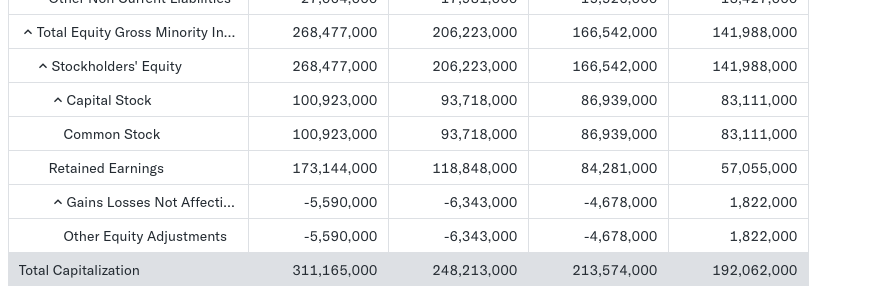

Net capital calculation 

https://finance.yahoo.com/quote/MSFT/balance-sheet/

Equity amount of money owned by the shareholder thorugh net income, dividens and retained earnigns from the previous accounting period. 

Return on equity is the measure calculated as the 

https://www.overleaf.com/read/cjvhkqqwmvyy#7bc1f3